# DevOps Orchestration for IoT Application

This repository contains the CI/CD pipeline setup and configurations used for the IoT application from the "Programming the IoT" book. The project demonstrates continuous integration, automated testing, and deployment using various DevOps tools and practices. This example is designed to help others learn about CI/CD pipelines and DevOps orchestration.

## Project Overview

The main objective of this project was to implement a robust DevOps environment to enhance collaboration between development, quality assurance (QA), and operations teams. The CI/CD pipeline ensures that new features are smoothly integrated and deployed with high reliability.

## DevOps Architecture

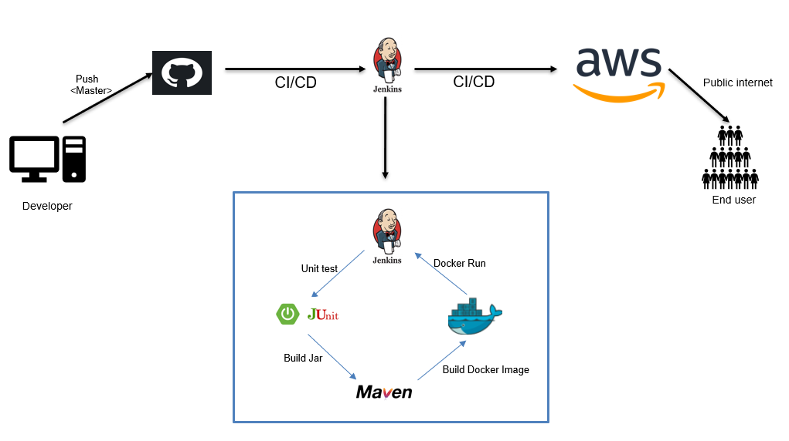

This architecture illustrates the flow of code through the CI/CD pipeline, utilizing tools such as GitHub, Jenkins, Maven, Docker, and AWS. The pipeline is triggered by code changes in GitHub, followed by automated building, testing, and deployment of the application on AWS servers.

## AWS Server Configuration

Two AWS servers were configured for this project:

1. **Jenkins Server**: Used for CI/CD orchestration.
    - Configuration: Low-config free-tier server.
2. **Deployment Server**: Hosts Docker containers for the application.
    - Configuration: Low-config free-tier server.

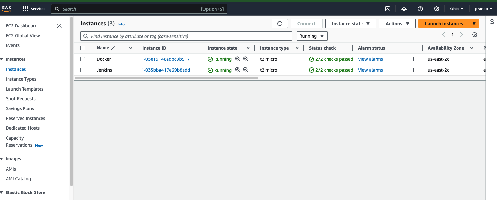

 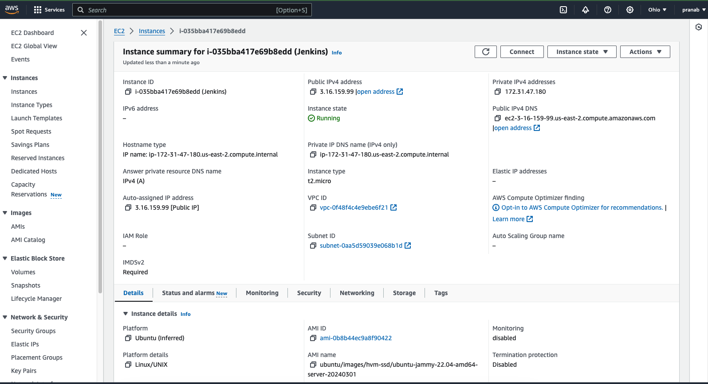
## GitHub Webhook Configuration

GitHub webhooks are configured to trigger Jenkins jobs whenever new code is pushed to the repository. This initiates the CI/CD pipeline for building, testing, and deploying the application.

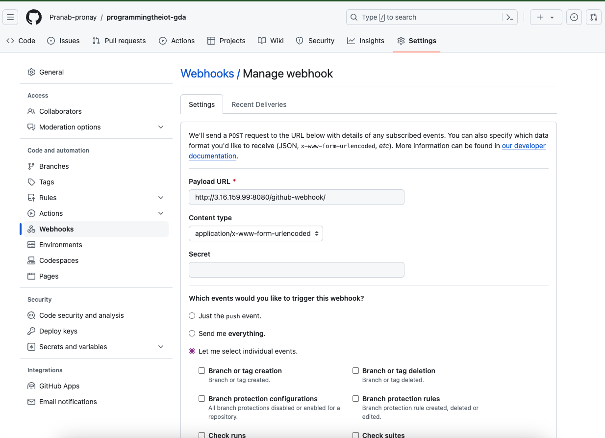

## Jenkins Configuration

Jenkins is configured to automate the stages of the CI/CD pipeline, including:

1. **Maven Setup**:
    - Installed Apache Maven 3.9.6 in Jenkins for building the Java application.
   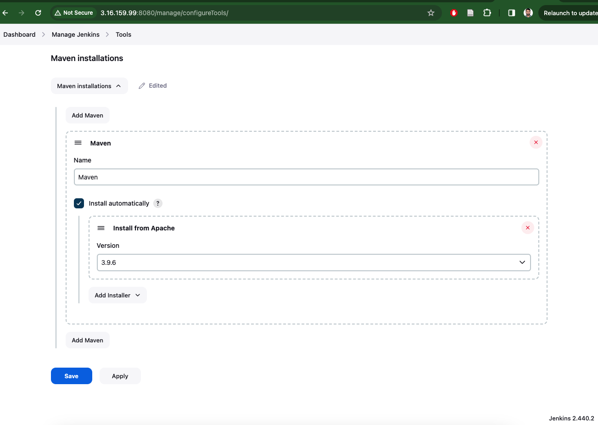
2. **SSH Key Generation**:
    - Generated an SSH key pair on the Jenkins server.
    - Added the public key to the deployment server for secure communication.
    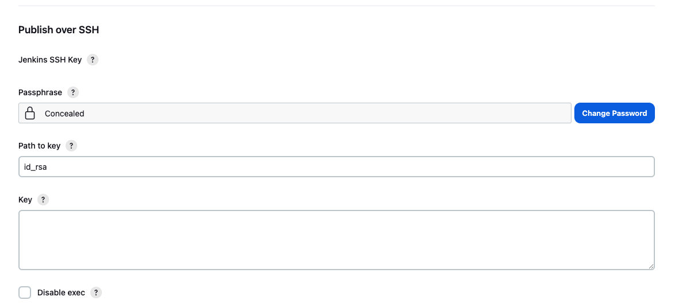
3. **Publish Over SSH**:
    - Configured Jenkins to use the SSH key for deploying artifacts to the deployment server.
   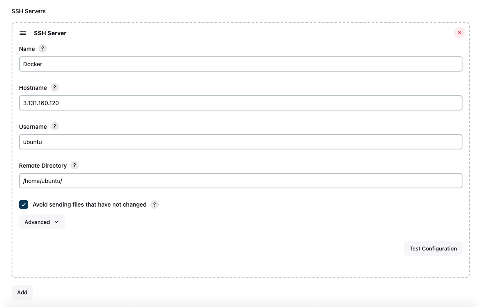
4. **Email Notification**:
    - Configured Jenkins to send email notifications for build and deployment status using Gmail SMTP.
   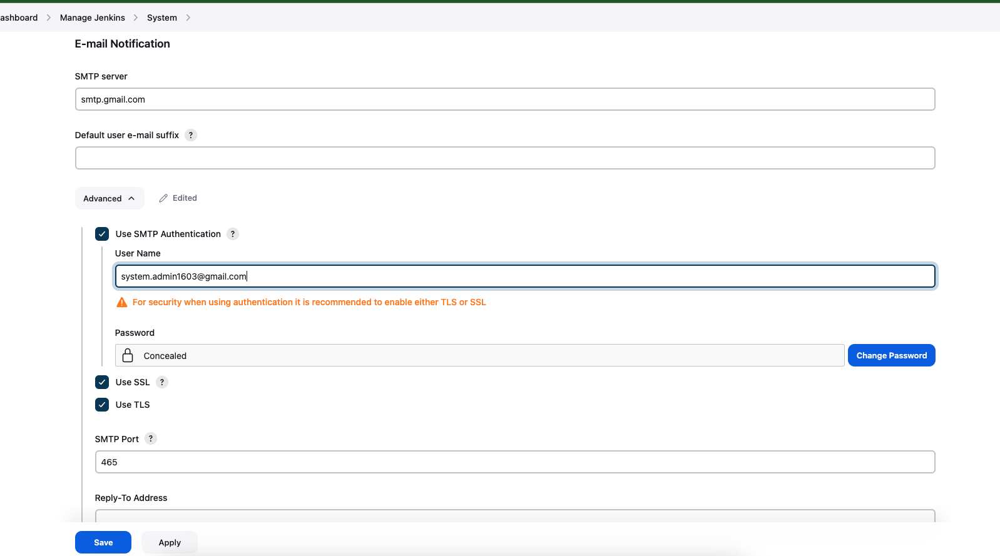

      

## GDA Pipeline Configuration


1. **Source Code Management**:
    - Configured Jenkins to use the `master` branch from the GitHub repository.
    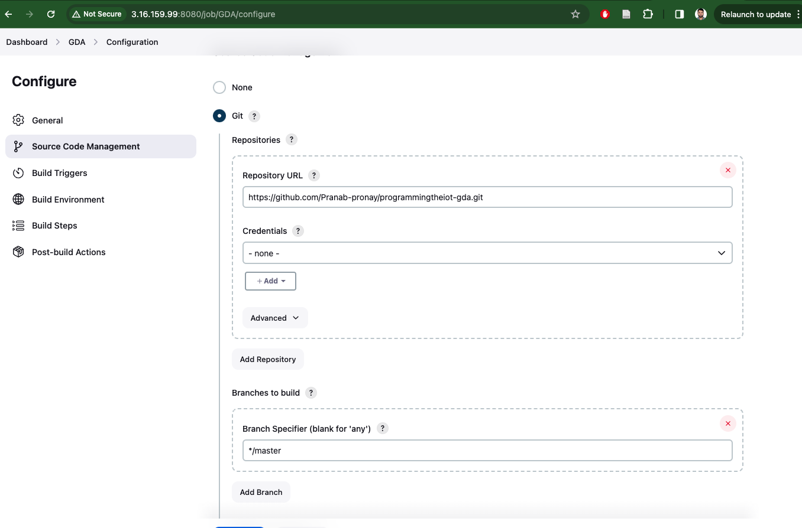
2. **Build Steps**:
    - Executed `mvn test`, `mvn clean`, and `mvn package` to test, clean, and build the application.
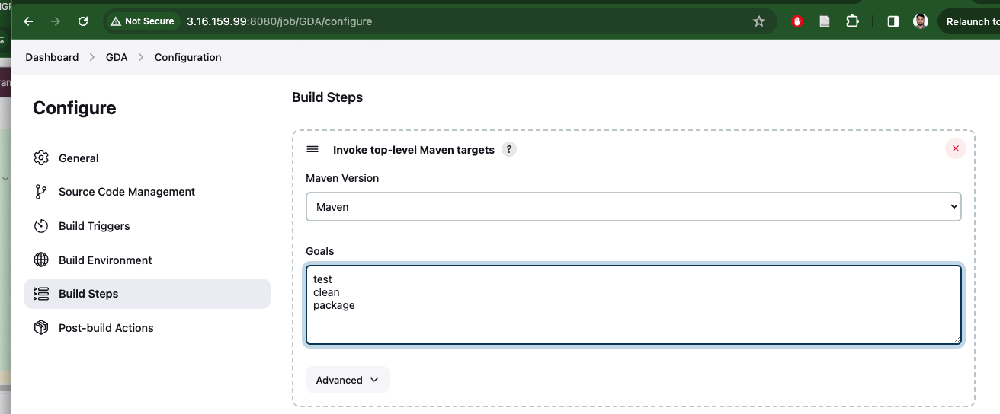

3. **Deployment**:
    - Used `publish over ssh` to copy the workspace to the deployment server.
    - Ran a script to test, build, and run the Docker image on the deployment server.
     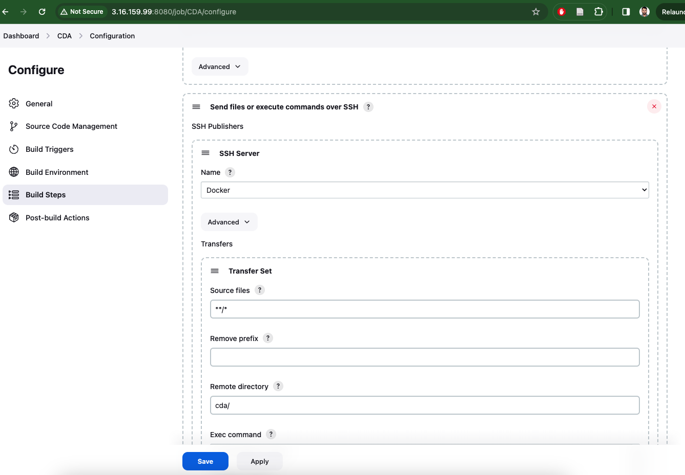

   
In the Exec command block, below script have been written to run the application in the deployment server. Build a docker image named ‘GDA’ and Run that image.
   ```bash
   cd /home/ubuntu/gda/
   mvn test
   DOCKER_IMAGE_NAME="gda"
   DOCKER_CONTAINER_NAME="gda"
   DOCKER_PORT_MAPPING="8041:8041"
   DOCKER_OPTIONS="--rm -d"
   docker ps -a | grep "${DOCKER_CONTAINER_NAME}" | awk '{print $1}' | xargs -r docker stop
   docker ps -a | grep "${DOCKER_CONTAINER_NAME}" | awk '{print $1}' | xargs -r docker rm
   docker build -t "${DOCKER_IMAGE_NAME}" .
   docker run ${DOCKER_OPTIONS} --name "${DOCKER_CONTAINER_NAME}" -p "${DOCKER_PORT_MAPPING}" "${DOCKER_IMAGE_NAME}"
  ```
  

4. **E-mail Notification**:
    - Added the recipient email address so that developers can get notifications for every event that occurs in Jenkins.
    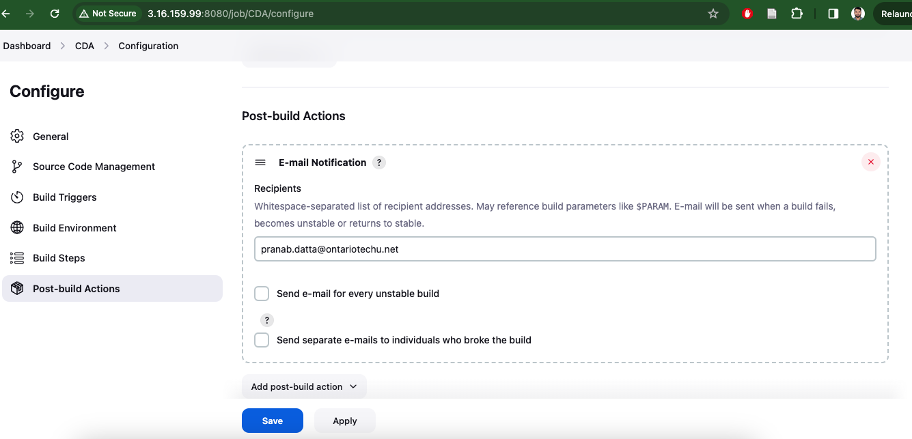

## Docker Configuration

### GDA Dockerfile
```bash
FROM openjdk:11
EXPOSE 8041
ADD target/gateway-device-app-0.0.1-jar-with-dependencies.jar gateway-device-app-0.0.1-jar-with-dependencies.jar
WORKDIR /app
ADD config /app/config
ENTRYPOINT ["java", "-jar", "/gateway-device-app-0.0.1-jar-with-dependencies.jar"]
```

## Learning Outcomes
This project showcases the implementation of a complete CI/CD pipeline using Jenkins, Docker, and AWS. It demonstrates the automation of building, testing, and deploying applications in a consistent and reproducible manner. By following this example, you can learn how to:

* Configure AWS servers for Jenkins and application deployment.
* Set up GitHub webhooks to trigger Jenkins jobs.
* Configure Jenkins for building, testing, and deploying applications.
* Use Docker for containerization and deployment of applications.
* Implement a robust CI/CD pipeline to improve collaboration and accelerate development.
* For more details, refer to the images and scripts provided in this repository.

### Acknowledgements
* "Programming the IoT" book for the project concept.
* Jenkins, Docker, and AWS for providing the necessary tools and services.